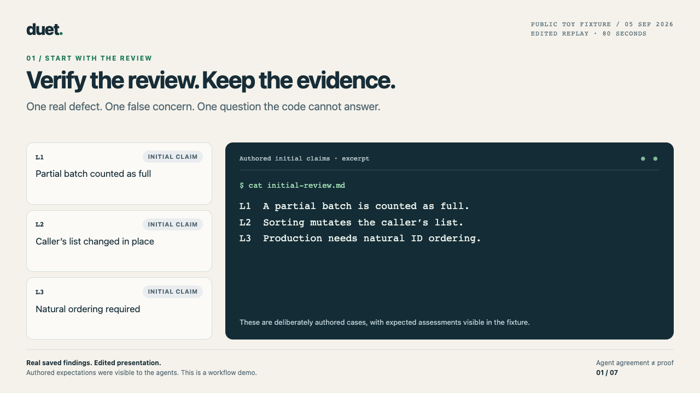

# duet

**Two CLI agents in conversation. One Python file. Stdlib only.**

`duet` runs two command-line coding agents in alternating turns until they
agree. By default that is Claude and Codex; Gemini, Copilot, and OpenCode are
also supported, and you can pair two agents from the same backend. One agent
plans or reviews while the other implements; each keeps its own session memory
across turns, and every run leaves a transcript you can inspect.

[](./docs/demos/finding-review.mp4)

**[Watch the 80-second review demo](./docs/demos/finding-review.mp4)** ·
[Replay it offline and inspect the source](./docs/demos/README.md) ·
[How the agent loop works (GIF)](./docs/assets/duet-deck.gif)

The demo replays saved findings from a public toy fixture, including an
unresolved requirement after a focused follow-up. Its expected answers were
visible to the agents: this demonstrates the workflow, not blind bug discovery
or comparative performance.

## Use it four ways

### 1. Inside Claude Code — `/duet`

The fastest path if you already live in Claude Code.

```text
/plugin marketplace add volkan/duet
/plugin install duet@volkan-duet
/duet
```

Plain `/duet` runs Claude Code's real `/review`, then loops Codex and Claude in
a worktree until they converge. Pass any upstream command as the kickoff:
`/duet 'npm test 2>&1' --turns 4`. The plugin shells out to the `duet` CLI, so
install that first (see below) and make sure `command -v duet` passes in Claude
Code's shell. Custom topology flags such as `--no-worktree` and
`--allow-worktree-fallback` replace the plugin defaults without emitting
conflicting CLI flags. Full guide:
[docs/CLAUDE_CODE_PLUGIN.md](https://github.com/volkan/duet/blob/main/docs/CLAUDE_CODE_PLUGIN.md).
If Claude Code disambiguates plugin commands with namespaces, `/duet:duet` is
the same command.

Autonomous handoff example:


While the handoff runs, Claude Code shows the shell in auto mode and exposes
the exact `duet` command under shell details:


Copy-ready version:

```text
/loop /goal Create a temporary todo.md from the plan above and the remaining
tasks in todo_codex.md.

1. Use /duet:duet with max reasoning to confirm the plan.
2. After the plan is confirmed, implement it.
3. Once the first implementation is done, use /duet:duet with max reasoning
   for code review.
4. Use /duet:duet with max reasoning to review the second plan, then implement
   it.
5. When the process is complete and all checks are green, merge the approved
   changes.

P.S. I will not be around, so handle decisions without me. If you need another
opinion, use /duet:duet to discuss it with Codex.
```

### 2. Inside Codex — `$duet`

```text
codex plugin marketplace add volkan/duet
codex plugin add duet@volkan-duet
```

Start a new Codex thread and invoke `$duet`, or just ask Codex to use duet in
plain language. Like the Claude Code plugin, the skill shells out to the `duet`
CLI, so install that first (see below) and make sure `command -v duet` passes in
Codex's shell. Full guide:
[docs/CODEX_PLUGIN.md](https://github.com/volkan/duet/blob/main/docs/CODEX_PLUGIN.md).

### 3. Inside OpenCode — `/duet`

OpenCode custom commands are drop-in files — no marketplace step:

```bash
mkdir -p ~/.config/opencode/command
cp plugins/duet-opencode/command/duet.md ~/.config/opencode/command/duet.md
```

Then invoke `/duet` in the OpenCode TUI (or `opencode run --command duet "..."`
non-interactively). Like the other plugins it shells out to the `duet` CLI, so
install that first and make sure `command -v duet` passes in OpenCode's shell.
The command runs on OpenCode's `build` agent; plain `/duet` runs the same
`claude -p /review --model sonnet` kickoff, and
`/duet 'npm test 2>&1' --turns 4` seeds from any command. Custom worktree
overrides are constructed conditionally, matching the Claude and Codex entry
points. Full guide:
[docs/OPENCODE_PLUGIN.md](https://github.com/volkan/duet/blob/main/docs/OPENCODE_PLUGIN.md).
(duet can also drive OpenCode as a backend — `--partner opencode:coder` — so
OpenCode can be one of the two looped agents too.)

### 4. From the terminal — `duet`

```bash
pipx install duet-cli        # recommended; the command it installs is `duet`
duet --task "Fix the failing test" --cwd ~/code/myrepo
```

`pipx` is the recommended install. Two other persistent options put `duet` on
PATH the same way:

```bash
uv tool install duet-cli
python3 -m pip install --user duet-cli
```

The PyPI package is `duet-cli` (bare `duet` on PyPI is Google's async library).
Add the `[yaml]` extra for `--config foo.yaml` support — `pipx install
'duet-cli[yaml]'`, `uv tool install 'duet-cli[yaml]'`, or `python3 -m pip
install --user 'duet-cli[yaml]'`. One-shot, no install:
`uvx --from duet-cli duet --task "..."` — note this is ephemeral and does not put
`duet` on PATH, so the `/duet` and `$duet` plugins need a persistent install
(`pipx install duet-cli`, `uv tool install duet-cli`,
`python3 -m pip install --user duet-cli`, or `make install`) instead.

## Examples

Each command teaches one capability. The partner agent speaks first.

**Review loop** — Codex reviews at max effort, Claude applies only the fixes
Codex asks for, in an isolated worktree:

```bash
duet --task "Review the latest commit; fix only what the reviewer requests." \
    --lead claude:coder --partner codex:reviewer \
    --reasoning max --worktree --worktree-for lead --turns 6
```

**Seed from another tool's output** — drive the loop from Claude Code's real
`/review`, a test run, or any command:

```bash
duet --recipe review --cwd ~/workspace/project
```

The review recipe uses recap mode, `claude:reviewer` + `codex:coder`, six
turns, `claude -p /review --model sonnet`, and strict worktree isolation.
Claude agents use the stable `sonnet` alias unless an explicit slot model
overrides it. The recipe also sets
`--on-turn-timeout continue`, so when the coder turn times out the reviewer
still gets the timeout block plus the worktree diff to review instead of the
run dying reviewless. Explicit flags override recipe values.

**Deterministic automation** — discover the run without parsing terminal prose,
then poll the curated status schema:

```bash
control_dir=$(mktemp -d)
duet --recipe review --run-info-file "$control_dir/run.json" &
duet_pid=$!
while [ ! -s "$control_dir/run.json" ]; do sleep 0.1; done
run_dir=$(python3 -c 'import json,sys; print(json.load(open(sys.argv[1]))["run_dir"])' "$control_dir/run.json")
duet --status "$run_dir" --json
wait "$duet_pid"
```

**Deep planner, fast coder** — Claude plans at high effort while Codex coder
turns drop to low for latency:

```bash
duet --reasoning high --codex-fast \
    --task "Fix the issue" --cwd ~/workspace/project
```

Use `--no-codex-fast` to override a config or continued run that enabled it.

**Inspect claims and disagreements** — the review recipe writes a local
`review.md` with stable finding IDs, each agent's assessment, cited evidence,
and unresolved objections. Agent agreement and executed checks are shown
separately:

```bash
duet --report RUN_DIR_OR_ID
duet --continue RUN_DIR_OR_ID --resolve L1 --turns 2  # unresolved IDs only
duet --feedback RUN_DIR_OR_ID --usefulness useful --decision corrected_comment
```

Other tasks can enable this with `--finding-reports`. Feedback is optional and
records your judgment, not verified correctness. See the
[finding workflow](https://github.com/volkan/duet/blob/main/docs/FINDINGS.md) and
[reproducible toy example](https://github.com/volkan/duet/tree/main/examples/review-evidence).

**Inspect local performance data** — view curated metrics snapshots saved
outside the project directory:

```bash
duet --stats
duet --stats --json
duet --stats --refresh              # import discoverable older run states
duet --stats --refresh ~/old-runs   # import one explicit runs root
```

Metrics are enabled by default unless `DUET_METRICS=0`, contain numeric and
configuration metadata only, and never upload automatically. Use
`--no-metrics` or `metrics_enabled: false` to disable collection. See the
[metrics reference](https://github.com/volkan/duet/blob/main/docs/METRICS.md)
for the schema, privacy boundary, refresh rules, and interpretation limits.
`DUET_METRICS=0` also overrides collection settings in config files and
continued runs.
Refresh tolerates invalid timestamps, and reports mark overflowing cost totals
as unknown.

**Verify gate** — a convergence proposal only counts if `make test` exits 0;
any failure feeds back into the next turn:

```bash
duet --task "Fix the issue" \
    --lead claude:coder --partner codex:reviewer \
    --verify-cmd 'make test' --worktree --worktree-for lead
```

**Resume a plan** — plan with Codex in its own session, then hand the session
id to duet; Codex implements with the plan in context while Claude reviews
(`--resume-claude <id>` does the inverse):

```bash
duet --resume-codex <codex-session-id> --worktree --reasoning max \
    --task "Implement the plan from your Codex planning session."
```

Reusable configs ship under `examples/` — `pr-review.yaml` (deep review of
`HEAD`) and `codex-test-fix.yaml` (Codex planner diagnoses failing checks, Codex
coder fixes them). Run one with `duet --config examples/pr-review.yaml`.

## How it works

Each agent keeps its own conversation memory across turns (Claude via
`--resume`, Codex via `codex exec resume`, Gemini, Copilot, and OpenCode via
their JSON session ids). On each turn duet sends one agent's latest reply to the
other.

To converge, an agent must include an `LGTM rationale:` explaining why the work
is done, followed by the sentinel `<<<LGTM>>>` on its own line — a bare
sentinel is ignored, and **both** agents must agree in back-to-back turns. The
loop also stops on `--turns`, a per-turn timeout, or Ctrl-C. With
`--on-turn-timeout continue` (the review recipe's default) a single turn
timeout is handed to the partner instead of ending the run; two consecutive
timeouts still stop. Without `--timeout`, the per-turn budget scales with the
reasoning level (900s → 1800s at `xhigh`/`max`). After a normal
stop, duet opens a `force>` prompt so you can push another round.

Every run writes a directory with `transcript.md`, `state.json`, per-turn
stderr logs, and the `wt/` worktree when `--worktree` is on. Inspect a run with
`duet --status <run-id> --json` (or omit `--json` for the human view), list runs
with `duet --list`, stop one exact live run with `duet --stop <run-id>`, and
start a fresh run
from saved state with `duet --continue <run> --task "next thing"`.

When metrics are enabled, duet also writes one standalone curated snapshot to
`~/.duet/metrics/runs/<UUID>.json`. This store survives deletion of a project
or its raw run directory; a best-effort home-directory write failure only emits
a warning and does not fail the agent run. Raw transcripts, prompts, paths,
commands, errors, credentials, and session IDs remain in the configured run
directory and are never copied into central metrics.

`--stop` is graceful. It lets the current agent turn finish before duet records
`force_stop`. Use `--stop <run-id> --immediate` to terminate that run's active
child and record `force_stop` now. Both forms validate the saved supervisor PID
and process-start identity. They never use a process-name match or signal a
different duet run.

If status remains `awaiting_force`, press Enter in the original terminal.
Some platforms do not wake the blocking `force>` input after an external signal.

- **Backends:** `claude`, `codex`, `gemini`, `copilot`, `opencode`
- **Roles:** `planner`, `coder`, `reviewer`, `triage-reviewer`, or a custom one
- **Reasoning:** `--reasoning minimal|low|medium|high|xhigh|max`

## Limits / future

Timeout continuation applies only to automatic loop turns. Seed extraction
and forced turns still stop on timeout. A final-turn timeout also stops because
no partner turn remains, and two consecutive timeouts stop the run. Poll
`duet --status <run-id> --json` to watch the current budget instead of assuming
a deep-reasoning turn is stuck.

## Documentation

[docs/USAGE.md](https://github.com/volkan/duet/blob/main/docs/USAGE.md) is the
full reference: every flag, reasoning levels, session memory, output layout,
`--status` / `--stop` / `--continue`, the force prompt, Codex sandbox and network rules,
and worktree mode.

[docs/METRICS.md](https://github.com/volkan/duet/blob/main/docs/METRICS.md)
documents central metrics collection, the snapshot schema, refresh/import
behavior, and the limits of comparisons.

[docs/FINDINGS.md](https://github.com/volkan/duet/blob/main/docs/FINDINGS.md)
documents finding reports, focused continuation, and optional human feedback.

[Usage evidence and product direction](https://github.com/volkan/duet/blob/main/docs/USAGE_EVIDENCE.md) summarizes an
anonymized audit of one developer's history across two computers, its limits,
and proposed next steps. The [validation plan](https://github.com/volkan/duet/blob/main/docs/launch/validation-plan.md)
describes a public demonstration and pilot to test the workflow with others.

## Contributing

Contributor guidance is in
[CLAUDE.md](https://github.com/volkan/duet/blob/main/CLAUDE.md); Codex entry
notes are in [AGENTS.md](https://github.com/volkan/duet/blob/main/AGENTS.md).
CI runs on every PR and is advisory until marked required — see
[.github/BRANCH_PROTECTION.md](https://github.com/volkan/duet/blob/main/.github/BRANCH_PROTECTION.md).
